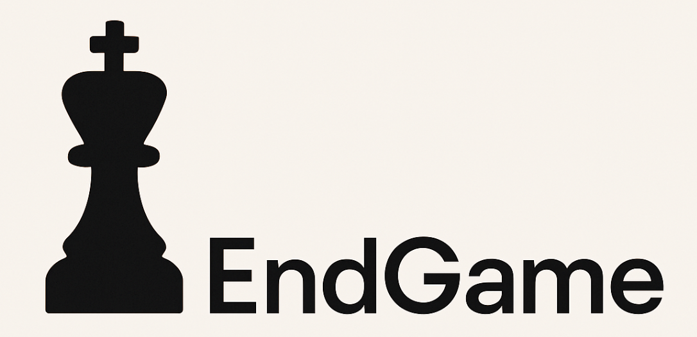

  

CHANGE THIS BADGES

End Game is a sleek and modern web app that lets players challenge friends or AI in real-time chess matches with built-in chat, move history, and personalized game settings.

# !!!!INSERT DEMO GIF HERE

## 📚 Table of Contents
- [💬 Introduction](#-introduction)
- [🚀 Features](#-features)
- [▶️ Demo](#-demo)
- [🧰 Tech Stack](#-tech-stack)
- [🛠️ Installation](#-installation)
- [🧪 Usage](#-usage)
- [👨‍💻 Code Examples](#-code-examples)
- [⚙️ Configuration](#-configuration)
- [📁 Project Structure](#-project-structure)
- [📝 License](#-license)
- [❓FAQ](#faq)
- [👥 Contributors](#-contributors)
- [🙏 Acknowledgments](#-acknowledgments)

## 💬 Introduction

## 🚀 Features

## ▶️ Demo

!!! INSERT YOUTUBE VIDEO HERE

## 🧰 Tech Stack
chess.js
stockfish.js
react-chessboard
zustand
ws
react-router-dom

## 🛠️ Installation

## 🧪 Usage

## 👨‍💻 Code Examples

## ⚙️ Configuration

## 📁 Project Structure

## 📝 License

## ❓FAQ

## 👥 Contributors

| [ @Jason Devaraj](https://github.com/d-jason32) | [ @Jaspreet Singh](https://github.com/jaspreet2004) | [ @Shahran Islam](https://github.com/Shahran-Islam) | [ @Melvin Salamo](https://github.com/melvinsalamo) |
|:-----------------------------------------------------------------------------------------------------------------------:|:------------------------------------------------------------------------------------------------------------------------------:|:------------------------------------------------------------------------------------------------------------------------------:|:-----------------------------------------------------------------------------------------------------------------------------:| 

## 🙏 Acknowledgments

- Special thanks to **Prof. Stephen Hooghuis** for his guidance and support throughout the development of this project.